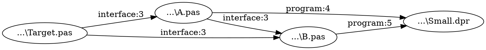

# Delphi Unit Backtrace

[Portuguese README](README.md)

Console tool that maps **everything a Delphi project uses from its DPR** or answers **which files use a selected unit and through which paths it reaches the project**. Only the `.dproj` is required; `--unit` selects backtrace mode. Outputs are a report in `result.txt`, a navigable graph in `graph.html`, links in `graph.dot`, and analysis decisions in `analysis.log`.

## Download and run

Download the Win64 or Win32 ZIP from the [latest release page](https://github.com/regyssilveira/delphi-unit-backtrace/releases/latest) and extract it. From the project directory, run:

```powershell
D:\Tools\UnitBacktrace.exe --project MyApp.dproj
```

This creates the complete map of dependencies reachable from the DPR. For a specific unit backtrace:

```powershell
D:\Tools\UnitBacktrace.exe --project MyApp.dproj --unit uExtractor
```

Without `--output`, the map goes to `analysis-output\<project>-<identifier>\project-map`; a backtrace goes to `analysis-output\<project>-<identifier>\<unit>`. The identifier derives from the `.dproj` path, so projects with the same name in different folders stay separate. An explicit `--output` uses the requested folder. If analysis is partial (exit code `3`), review `analysis.log`. The ZIP includes third-party licenses and notices.

```powershell
UnitBacktrace.exe --project "D:\MyApp\MyApp.dproj" --unit uExtractor --output "D:\Analysis"
```

It scans the project directory and evaluates `DCC_UnitSearchPath`, `DCC_IncludePath`, and `DCC_Define` through Delphi 13 MSBuild for the selected configuration and platform. It also reads the IDE's registered Search and Browsing Paths for library sources. Defaults come from the `.dproj`; use `--platform Win32|Win64` and `--config Debug|Release` to select them. If library sources are outside these paths, repeat `--source-root DIR` to add recursive source roots. `--no-global-path` limits the scope to project paths. It parses interface and implementation `uses` clauses with [DelphiAST](https://github.com/RomanYankovsky/DelphiAST), falls back to token extraction for unsupported syntax, and identifies nodes by resolved file path. Short unit names use the project's namespace order. Textual path enumeration stops at 10,000 paths to avoid combinatorial explosion; DOT retains every reachable edge.

An additional root broadens the analysis scope; warnings from other library units may also appear in the log.

The code separates models and interfaces (`Reverse.Domain`), source parsing (`Reverse.AST`), project and IDE paths (`Reverse.MSBuild` and `Reverse.DelphiPaths`), source discovery (`Reverse.Scope`), reference resolution (`Reverse.Analysis`), graph traversal (`Reverse.Graph`), and output/logging (`Reverse.Output` and `Reverse.Log`). Interfaces allow the parser, MSBuild evaluator, global path provider, and logger to be replaced in tests or other implementations.

## Build and test with Delphi 13

```powershell
git clone --recurse-submodules https://github.com/regyssilveira/delphi-unit-backtrace.git
cd delphi-unit-backtrace
.\tools\Build.ps1 -Platform Win64
.\tools\Build.ps1 -Tests -Platform Win64
.\bin\Win64\UnitBacktraceTests.exe
.\bin\Win64\UnitBacktrace.exe --project .\tests\fixtures\Small\Small.dproj --no-global-path --output .\bin\project-map-output
node .\tests\ProjectMap.Render.test.js .\bin\project-map-output\graph.html
.\bin\Win64\UnitBacktrace.exe --project .\tests\fixtures\Small\Small.dproj --unit Target --no-global-path --output .\bin\workflow-test
node .\tests\Visual.Trace.test.js .\bin\workflow-test\graph.html
node .\tests\Visual.Render.test.js .\bin\workflow-test\graph.html
```

The build script detects Delphi 13 (BDS 37.0) from the `BDS` environment variable or the registered `RootDir` in HKCU/HKLM, then checks that the compiler for the selected platform exists. DUnitX ships with RAD Studio 13; DelphiAST is a Git submodule. The optional Node.js test checks the generated JavaScript trace logic.

The executable for local testing is `bin\Win64\UnitBacktrace.exe`. Each analysis writes `result.txt`, `graph.dot`, `graph.html`, and `analysis.log` to the output directory. Open `graph.html` in a browser to search and center a unit. Selecting a file highlights one chain of `uses` declarations to the DPR, or to a project file when the DPR is unreachable. Previous and Next navigate every declaration in the chain without a step limit; Copy file:line copies the selected declaration. You can isolate the chain, inspect direct neighbors, or show every resolved route reaching the DPR. Zoom, fit chain or visible graph, pointer dragging, and the visual section filter make larger graphs easier to inspect.

In the default mode, without `--unit`, analysis starts at the DPR and includes only files actually reachable through `uses` declarations, including files found through Search Paths or `--source-root`. The HTML opens in the **Folders** view, aggregates relationships between directories, and can switch to **Units**. **Group directories** detects the actual tree depth and offers every available level — 1, 2, 3, and so on — plus the full path. Clicking a group with subfolders drills into the next level; **Back one level** restores the previous grouping. Once a physical folder is reached, clicking opens only its units, avoiding an attempt to render thousands of files at once. Wider cards show longer names and expose the full path on hover. The sidebar includes a deduplicated summary with file, incoming, and outgoing relationship counts for every physical folder, followed by the **Folders and files** tree. Selecting a unit switches to the detailed graph filtered to that file. Search accepts folders, units, or full paths, and the filter separates DPR, `interface`, and `implementation`.

The graph opens in progressive mode with the target unit and its direct consumers. At the top, **Progressive view** restores this clean view and **Full graph** shows every file so you can start with the complete set and reduce it with search, filters, hidden branches, or isolated routes. The route list groups chains by DPR, project, library, missing consumer, and cycle; selecting an entry isolates that chain. Branch controls expand the next level, expand to the DPR or terminal, collapse, and hide a branch. Double-click isolates a unit route, while pointer hover highlights its chain and fades unrelated links. The layout repeatedly orders nodes by their neighbors to reduce crossings and places the DPR, final project files, and library roots in a common destination column.

The cut simulation lets you mark one or more `uses` declarations and see whether any resolved target-to-DPR route remains. It never edits source files, and the visual section filter does not affect the calculation. Another panel lists direct consumers to review. Potentially relevant ambiguous or unresolved references are marked uncertain; other warnings remain in the log. On graphs with more than 250 files, the initial view shows direct consumers and expands as files are selected; the full graph remains available. The HTML is self-contained and needs no installed graph renderer. Review the log before changing source when the result is partial.

Every discovered source records its origin: project folder, explicit project reference, project Search Path, global IDE Search Path, or `--source-root`. Chains have a structured destination: DPR, project file, library root, no known consumer, or cycle. In the HTML, **Show usage outside the DPR** isolates branches that continue only through libraries or files detached from the project entry point, while the source-origin filter narrows the graph by group. **Show all routes** restores the full set. The console and `result.txt` count each destination, and text paths end in `[DPR]`, `[PROJECT]`, `[LIBRARY]`, `[NO CONSUMER]`, or `[CYCLE]`.

Output generation removes exactly identical path and evidence lines, as well as duplicate DOT node and edge declarations. Dependencies with different files, sections, or source lines remain distinct. A large project can still have thousands of distinct reverse paths; the text listing is capped at 10,000 paths while the graph keeps reachable links.

The console shows a 24-position bar, percentage, and count for every stage with a known total; graph traversal remains in progress until it finishes. In an interactive terminal, the bar replaces the current line and only the completed stage remains in the history. Redirected output uses separate lines so a saved log stays readable. Updates are throttled to one every 500 ms per stage, plus stage start and completion. At completion, a summary counts direct consumers, `uses` declarations and reachable links to the DPR, and indicates partial results.

## Logs and exit codes

The UTF-8 log records `INFO`, `WARN`, `ERROR`, and `DEBUG`: target candidates, each dependency, the file selected for each reference, parser or MSBuild fallbacks, failures, and unresolved search paths. Exit code `0` means no fallbacks, failed files, unresolved or ambiguous references; `1` is a fatal error; `2` means required arguments are missing; `3` means a partial result was written. Unresolved relationships remain in the log and are excluded from the graph.

## Current scope

The current scope is declared `uses` dependencies, not proof of symbol usage. The parser applies project conditional symbols and the selected Win32/Win64 platform symbols. Unresolved and ambiguous references are logged and excluded from the resolved graph; potentially relevant ones are also listed in the HTML. If MSBuild evaluation fails, `msbuild-fallback` is logged and textual path and define extraction may include other configurations; unknown `$(...)` path macros are logged for review. The reproducible synthetic fixture has 2,202 source files across a project and three external libraries. DUnitX tests cover parsing, fallback, includes, conditional MSBuild paths and symbols, file and namespace resolution, graph traversal, and console output.

## Sample output

The small project in `tests/fixtures/Small` reproduces the output without external libraries. Run from the repository root.

```powershell
.\bin\Win64\UnitBacktrace.exe --project .\tests\fixtures\Small\Small.dproj --unit Target --no-global-path --output .\bin\readme-example-output
```

The excerpts below show the main lines. Absolute path prefixes were shortened and log timestamps were omitted.

`result.txt` shows reverse paths to the DPR and the line declaring each `uses`.

```text
Target: Target | ...\Small\Target.pas
Project entry: Small
Parsed: 4 | AST fallback: 0 | Failed: 0 | Unresolved: 0 | Ambiguous: 0 | Reachable edges: 5

Reverse paths:
Target -> A -> B -> Small [DPR]
Target -> A -> Small [DPR]
Target -> B -> Small [DPR]

Evidence:
Target -> A | interface | ...\Small\A.pas:3 | used file: ...\Small\Target.pas
```

`graph.dot` retains every reachable link; each node uses the file's physical path.



`analysis.log` records platform, path evaluation, dependencies, and a summary.

```text
[INFO] platform | Win32
[INFO] config | Debug
[INFO] msbuild-evaluated | DCC_UnitSearchPath | 1 entries
[DEBUG] dependency | ...\Small\A.pas:3 | A uses Target
[INFO] complete | 4 parsed; 0 fallback; 0 failed; 0 unresolved; 0 ambiguous; 5 reachable edges; 0 ms
```

`[DPR]` means the path reached the project entry point; `interface:3` identifies the section and line of the declaration.

## License

This project's code is licensed under [Apache-2.0](LICENSE). DelphiAST remains under its upstream licenses: MPL-2.0 for DelphiAST and MPL-1.1 notices on four SimpleParser files compiled into the application. See [THIRD_PARTY_LICENSES.md](THIRD_PARTY_LICENSES.md) and [NOTICE](NOTICE) for attribution and source links. Git history preserves earlier commits under MIT.
