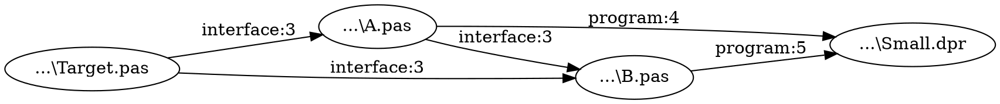

# Delphi Unit Backtrace

[Portuguese README](README.md)

Console tool answering **which Delphi units use a selected unit, and through which paths it reaches the DPR**. Only a `.dproj` file and the unit name are required; the program finds the `.pas` file. Outputs are reverse paths in `result.txt`, all reachable links in `graph.dot`, and analysis decisions in `analysis.log`.

```powershell
UnitBacktrace.exe --project "D:\MyApp\MyApp.dproj" --unit uExtractor --output "D:\Analysis"
```

It scans the project directory and evaluates `DCC_UnitSearchPath` and `DCC_IncludePath` through Delphi 13 MSBuild for the selected configuration and platform. It also reads the IDE's registered Search and Browsing Paths for library sources. Defaults come from the `.dproj`; use `--platform Win32|Win64` and `--config Debug|Release` to select them. If library sources are outside these paths, repeat `--source-root DIR` to add recursive source roots. `--no-global-path` limits the scope to project paths. It parses interface and implementation `uses` clauses with [DelphiAST](https://github.com/RomanYankovsky/DelphiAST), falls back to token extraction for unsupported syntax, and identifies nodes by resolved file path. Short unit names use the project's namespace order. Textual path enumeration stops at 10,000 paths to avoid combinatorial explosion; DOT retains every reachable edge.

An additional root broadens the analysis scope; warnings from other library units may also appear in the log.

The code separates models and interfaces (`Reverse.Domain`), source parsing (`Reverse.AST`), project and IDE paths (`Reverse.MSBuild` and `Reverse.DelphiPaths`), source discovery (`Reverse.Scope`), reference resolution (`Reverse.Analysis`), graph traversal (`Reverse.Graph`), and output/logging (`Reverse.Output` and `Reverse.Log`). Interfaces allow the parser, MSBuild evaluator, global path provider, and logger to be replaced in tests or other implementations.

## Build and test with Delphi 13

```powershell
git clone --recurse-submodules https://github.com/regyssilveira/delphi-unit-backtrace.git
cd delphi-unit-backtrace
.\tools\Build.ps1 -Platform Win64
.\tools\Build.ps1 -Tests -Platform Win64
.\bin\Win64\UnitBacktraceTests.exe
```

The build script uses the local installation at `C:\Program Files (x86)\Embarcadero\Studio\37.0`. For another location, change `$bdsRoot` in `tools/Build.ps1`. DUnitX ships with RAD Studio 13; DelphiAST is a Git submodule.

The executable for local testing is `bin\Win64\UnitBacktrace.exe`. Each analysis writes `result.txt`, `graph.dot`, and `analysis.log` to the directory selected by `--output`.

## Logs and exit codes

The UTF-8 log records `INFO`, `WARN`, `ERROR`, and `DEBUG`: target candidates, each dependency, the file selected for each reference, parser or MSBuild fallbacks, failures, and unresolved search paths. Exit code `0` means no fallbacks, failed files, unresolved or ambiguous references; `1` is a fatal error; `2` means required arguments are missing; `3` means a partial result was written. Unresolved relationships remain in the log and are excluded from the graph.

## Current scope

The current scope is declared `uses` dependencies. Unresolved and ambiguous references are logged and excluded from the graph. If MSBuild evaluation fails, `msbuild-fallback` is logged and textual path extraction may include other configurations; unknown `$(...)` path macros are logged for review. The reproducible synthetic fixture has 2,202 source files across a project and three external libraries. DUnitX tests cover parsing, fallback, includes, conditional MSBuild paths, file and namespace resolution, graph traversal, and console output.

## Sample output

The small project in `tests/fixtures/Small` reproduces the output without external libraries. Run from the repository root.

```powershell
.\bin\Win64\UnitBacktrace.exe --project .\tests\fixtures\Small\Small.dproj --unit Target --no-global-path --output .\bin\readme-example-output
```

The excerpts below show the main lines. Absolute path prefixes were shortened and log timestamps were omitted.

`result.txt` shows reverse paths to the DPR and the line declaring each `uses`.

```text
Target: Target | ...\Small\Target.pas
Project entry: Small
Parsed: 4 | AST fallback: 0 | Failed: 0 | Unresolved: 0 | Ambiguous: 0 | Reachable edges: 5

Reverse paths:
Target -> A -> B -> Small [DPR]
Target -> A -> Small [DPR]
Target -> B -> Small [DPR]

Evidence:
Target -> A | interface | ...\Small\A.pas:3 | used file: ...\Small\Target.pas
```

`graph.dot` retains every reachable link; each node uses the file's physical path.



`analysis.log` records platform, path evaluation, dependencies, and a summary.

```text
[INFO] platform | Win32
[INFO] config | Debug
[INFO] msbuild-evaluated | DCC_UnitSearchPath | 1 entries
[DEBUG] dependency | ...\Small\A.pas:3 | A uses Target
[INFO] complete | 4 parsed; 0 fallback; 0 failed; 0 unresolved; 0 ambiguous; 5 reachable edges; 0 ms
```

`[DPR]` means the path reached the project entry point; `interface:3` identifies the section and line of the declaration.

## License

This project's code is licensed under [Apache-2.0](LICENSE). DelphiAST remains under its upstream licenses: MPL-2.0 for DelphiAST and MPL-1.1 notices on four SimpleParser files compiled into the application. See [THIRD_PARTY_LICENSES.md](THIRD_PARTY_LICENSES.md) and [NOTICE](NOTICE) for attribution and source links. Git history preserves earlier commits under MIT.
