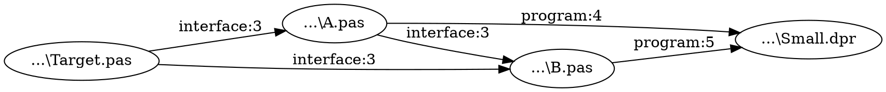

# Delphi Unit Backtrace

## Português

Ferramenta console para responder **quem usa uma unit Delphi e por quais caminhos ela chega ao DPR**. A entrada obrigatória é o arquivo `.dproj` e o nome da unit; o caminho do `.pas` é descoberto pelo programa. O resultado contém os caminhos reversos em `result.txt`, todas as ligações alcançáveis em `graph.dot` e decisões de análise em `analysis.log`.

```powershell
UnitBacktrace.exe --project "D:\MeuERP\MeuERP.dproj" --unit uExtrator --output "D:\Analise"
```

O programa procura fontes recursivamente na pasta do projeto e avalia `DCC_UnitSearchPath` e `DCC_IncludePath` com o MSBuild do Delphi 13 para a configuração e plataforma selecionadas. Em uma máquina com Delphi 13, também lê o Search Path e o Browsing Path registrados na IDE para localizar fontes de bibliotecas. Os padrões vêm do `.dproj`; use `--platform Win32|Win64` e `--config Debug|Release` para selecioná-los. Se fontes de uma biblioteca estiverem fora desses caminhos, `--source-root DIR` acrescenta uma raiz recursiva; a opção pode ser repetida. Para analisar somente os caminhos do projeto, use `--no-global-path`.

Uma raiz adicional amplia o escopo da análise; avisos de outras units da biblioteca também podem aparecer no log.

Também encontra arquivos referenciados diretamente pelo DPR, usa `MainSource` quando o DPR tem outro nome e procura includes relativos e em `DCC_IncludePath`. Lê `uses` em `interface` e `implementation` com [DelphiAST](https://github.com/RomanYankovsky/DelphiAST), identifica cada arquivo pelo caminho resolvido e preserva os ramos do grafo. Quando o DelphiAST rejeita uma sintaxe, a ferramenta tenta extrair os `uses` por tokens, registra o fallback e marca o resultado como parcial. Nomes curtos como `Classes` são resolvidos usando a ordem de namespaces do projeto. A enumeração textual é limitada a 10.000 caminhos para evitar explosão combinatória; o DOT conserva todas as ligações alcançáveis. Ciclos e ramos sem consumidores são identificados.

O código separa modelos e interfaces (`Reverse.Domain`), leitura de fontes (`Reverse.AST`), caminhos do projeto e da IDE (`Reverse.MSBuild` e `Reverse.DelphiPaths`), descoberta de fontes (`Reverse.Scope`), resolução de referências (`Reverse.Analysis`), travessia do grafo (`Reverse.Graph`) e saída/log (`Reverse.Output` e `Reverse.Log`). Parser, avaliação MSBuild, provedor de caminhos globais e log usam interfaces para permitir substituição em testes e outras implementações.

### Compilar e testar no Delphi 13

```powershell
git clone --recurse-submodules https://github.com/regyssilveira/delphi-unit-backtrace.git
cd delphi-unit-backtrace
.\tools\Build.ps1 -Platform Win64
.\tools\Build.ps1 -Tests -Platform Win64
.\bin\Win64\UnitBacktraceTests.exe
.\tools\Package-Release.ps1 -Version dev -Platform Win64
```

O script usa a instalação local `C:\Program Files (x86)\Embarcadero\Studio\37.0`. Para outro local, ajuste `$bdsRoot` em `tools/Build.ps1`. Os projetos `.dproj` também estão na raiz. DUnitX acompanha o RAD Studio 13; o DelphiAST é um submódulo Git.

O pacote ZIP gerado inclui o executável, a licença Apache, o `NOTICE`, as atribuições e os textos das licenças do parser. A release também oferece o `.exe` separado para testes rápidos.

### Log e códigos de saída

O log UTF-8 registra `INFO`, `WARN`, `ERROR` e `DEBUG`, incluindo candidatos para a unit alvo, cada relação encontrada, o arquivo escolhido para cada referência, fallback do parser ou MSBuild, falhas e caminhos de busca sem resolução. Código `0`: análise concluída sem falhas ou referências sem resolução; `1`: erro fatal; `2`: argumentos ausentes; `3`: resultado gerado com fallback, fontes ou referências sem resolução ou ambíguas. Relações não resolvidas ficam no log e não entram no grafo.

### Alcance atual

Esta versão analisa dependências declaradas em `uses`. Ela não verifica se um símbolo da unit é realmente chamado. Se a avaliação MSBuild falhar, o log registra `msbuild-fallback` e a leitura textual dos caminhos pode incluir configurações não selecionadas; variáveis `$(...)` sem valor conhecido são sinalizadas. O teste sintético reproduzível possui 2.202 fontes distribuídos entre o projeto e três bibliotecas externas. Os testes DUnitX cobrem parser, fallback, includes, caminhos condicionais MSBuild, resolução de arquivos e namespaces, grafo e saída console.

## English

Console tool answering **which Delphi units use a selected unit, and through which paths it reaches the DPR**. Only a `.dproj` file and the unit name are required; the program finds the `.pas` file. Outputs are reverse paths in `result.txt`, all reachable links in `graph.dot`, and analysis decisions in `analysis.log`.

```powershell
UnitBacktrace.exe --project "D:\MyApp\MyApp.dproj" --unit uExtractor --output "D:\Analysis"
```

It scans the project directory and evaluates `DCC_UnitSearchPath` and `DCC_IncludePath` through Delphi 13 MSBuild for the selected configuration and platform. It also reads the IDE's registered Search and Browsing Paths for library sources. Defaults come from the `.dproj`; use `--platform Win32|Win64` and `--config Debug|Release` to select them. If library sources are outside these paths, repeat `--source-root DIR` to add recursive source roots. `--no-global-path` limits the scope to project paths. It parses interface and implementation `uses` clauses with [DelphiAST](https://github.com/RomanYankovsky/DelphiAST), falls back to token extraction for unsupported syntax, and identifies nodes by resolved file path. Short unit names use the project's namespace order. Textual path enumeration stops at 10,000 paths to avoid combinatorial explosion; DOT retains every reachable edge. Build and test with the Delphi 13 commands above.

An additional root broadens the analysis scope; warnings from other library units may also appear in the log.

The code separates models and interfaces (`Reverse.Domain`), source parsing (`Reverse.AST`), project and IDE paths (`Reverse.MSBuild` and `Reverse.DelphiPaths`), source discovery (`Reverse.Scope`), reference resolution (`Reverse.Analysis`), graph traversal (`Reverse.Graph`), and output/logging (`Reverse.Output` and `Reverse.Log`). Interfaces allow the parser, MSBuild evaluator, global path provider, and logger to be replaced in tests or other implementations.

The release packaging script creates a ZIP containing the executable, Apache license, `NOTICE`, attributions, and the parser's MPL license texts. The release also provides the `.exe` separately for quick testing.

The current scope is declared `uses` dependencies. Unresolved and ambiguous references are logged and excluded from the graph. If MSBuild evaluation fails, `msbuild-fallback` is logged and textual path extraction may include other configurations; unknown `$(...)` path macros are logged for review. The reproducible synthetic fixture has 2,202 source files across a project and three external libraries. DUnitX tests cover parsing, fallback, includes, conditional MSBuild paths, file and namespace resolution, graph traversal, and console output.

## Exemplo de saída / Sample output

O projeto pequeno em `tests/fixtures/Small` permite reproduzir a saída sem bibliotecas externas. Execute a partir da raiz do repositório. / The small project in `tests/fixtures/Small` reproduces the output without external libraries. Run from the repository root.

```powershell
.\bin\Win64\UnitBacktrace.exe --project .\tests\fixtures\Small\Small.dproj --unit Target --no-global-path --output .\bin\readme-example-output
```

Trechos da execução; foram selecionadas as linhas principais, encurtados os prefixos dos caminhos absolutos e omitidos os horários do log. / Output excerpts; only the main lines are shown, absolute path prefixes were shortened, and log timestamps were omitted.

`result.txt` mostra os caminhos reversos até o DPR e a linha que declarou cada `uses`. / `result.txt` shows reverse paths to the DPR and the line declaring each `uses`.

```text
Target: Target | ...\Small\Target.pas
Project entry: Small
Parsed: 4 | AST fallback: 0 | Failed: 0 | Unresolved: 0 | Ambiguous: 0 | Reachable edges: 5

Reverse paths:
Target -> A -> B -> Small [DPR]
Target -> A -> Small [DPR]
Target -> B -> Small [DPR]

Evidence:
Target -> A | interface | ...\Small\A.pas:3 | used file: ...\Small\Target.pas
```

`graph.dot` preserva todas as ligações alcançáveis; cada nó usa o caminho físico do arquivo. / `graph.dot` retains every reachable link; each node uses the file's physical path.



`analysis.log` registra plataforma, avaliação de caminhos, dependências e resumo. / `analysis.log` records platform, path evaluation, dependencies, and a summary.

```text
[INFO] platform | Win32
[INFO] config | Debug
[INFO] msbuild-evaluated | DCC_UnitSearchPath | 1 entries
[DEBUG] dependency | ...\Small\A.pas:3 | A uses Target
[INFO] complete | 4 parsed; 0 fallback; 0 failed; 0 unresolved; 0 ambiguous; 5 reachable edges; 0 ms
```

`[DPR]` indica que o caminho alcançou a entrada do projeto; `interface:3` indica a seção e a linha da declaração. / `[DPR]` means the path reached the project entry point; `interface:3` identifies the section and line of the declaration.

## Licença / License

O código desta ferramenta está sob [Apache-2.0](LICENSE). O submódulo DelphiAST mantém suas licenças originais: MPL-2.0 para DelphiAST e avisos MPL-1.1 em quatro arquivos do SimpleParser usados no executável. Consulte [THIRD_PARTY_LICENSES.md](THIRD_PARTY_LICENSES.md) e [NOTICE](NOTICE) para atribuições e acesso às fontes. As versões anteriores distribuídas sob MIT preservam aqueles termos.

This project's code is licensed under [Apache-2.0](LICENSE). DelphiAST remains under its upstream licenses: MPL-2.0 for DelphiAST and MPL-1.1 notices on four SimpleParser files compiled into the application. See [THIRD_PARTY_LICENSES.md](THIRD_PARTY_LICENSES.md) and [NOTICE](NOTICE) for attribution and source links. Earlier MIT releases retain the license terms under which they were distributed.
