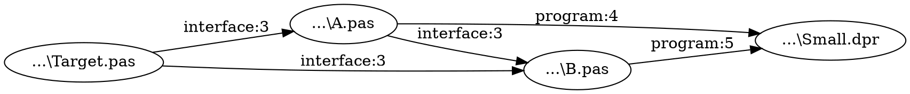

# Delphi Unit Backtrace

[README em inglês](README.en.md)

Ferramenta console para responder **quem usa uma unit Delphi e por quais caminhos ela chega ao DPR**. A entrada obrigatória é o arquivo `.dproj` e o nome da unit; o caminho do `.pas` é descoberto pelo programa. O resultado contém os caminhos reversos em `result.txt`, um grafo navegável em `graph.html`, as ligações em `graph.dot` e decisões de análise em `analysis.log`.

## Baixar e executar

Baixe o ZIP Win64 ou Win32 na [página da versão mais recente](https://github.com/regyssilveira/delphi-unit-backtrace/releases/latest) e extraia os arquivos. No diretório do projeto, execute:

```powershell
D:\Ferramentas\UnitBacktrace.exe --project MeuERP.dproj --unit uExtrator
```

Sem `--output`, o executável grava em `analysis-output\<projeto>-<identificador>\<unit>` no diretório atual, por exemplo `analysis-output\MeuERP-a1b2c3d4\uExtrator\graph.html`. O identificador deriva do caminho do `.dproj`, para distinguir projetos homônimos em pastas diferentes. Com `--output`, usa exatamente a pasta informada. Se a análise for parcial (código de saída `3`), consulte `analysis.log` antes de decidir quais declarações `uses` alterar. O ZIP inclui as licenças e avisos das dependências.

```powershell
UnitBacktrace.exe --project "D:\MeuERP\MeuERP.dproj" --unit uExtrator --output "D:\Analise"
```

O programa procura fontes recursivamente na pasta do projeto e avalia `DCC_UnitSearchPath`, `DCC_IncludePath` e `DCC_Define` com o MSBuild do Delphi 13 para a configuração e plataforma selecionadas. Em uma máquina com Delphi 13, também lê o Search Path e o Browsing Path registrados na IDE para localizar fontes de bibliotecas. Os padrões vêm do `.dproj`; use `--platform Win32|Win64` e `--config Debug|Release` para selecioná-los. Se fontes de uma biblioteca estiverem fora desses caminhos, `--source-root DIR` acrescenta uma raiz recursiva; a opção pode ser repetida. Para analisar somente os caminhos do projeto, use `--no-global-path`.

Uma raiz adicional amplia o escopo da análise; avisos de outras units da biblioteca também podem aparecer no log.

Também encontra arquivos referenciados diretamente pelo DPR, usa `MainSource` quando o DPR tem outro nome e procura includes relativos e em `DCC_IncludePath`. Lê `uses` em `interface` e `implementation` com [DelphiAST](https://github.com/RomanYankovsky/DelphiAST), identifica cada arquivo pelo caminho resolvido e preserva os ramos do grafo. Quando o DelphiAST rejeita uma sintaxe, a ferramenta tenta extrair os `uses` por tokens, registra o fallback e marca o resultado como parcial. Nomes curtos como `Classes` são resolvidos usando a ordem de namespaces do projeto. A enumeração textual é limitada a 10.000 caminhos para evitar explosão combinatória; o DOT conserva todas as ligações alcançáveis. Ciclos e ramos sem consumidores são identificados.

O código separa modelos e interfaces (`Reverse.Domain`), leitura de fontes (`Reverse.AST`), caminhos do projeto e da IDE (`Reverse.MSBuild` e `Reverse.DelphiPaths`), descoberta de fontes (`Reverse.Scope`), resolução de referências (`Reverse.Analysis`), travessia do grafo (`Reverse.Graph`) e saída/log (`Reverse.Output` e `Reverse.Log`). Parser, avaliação MSBuild, provedor de caminhos globais e log usam interfaces para permitir substituição em testes e outras implementações.

## Compilar e testar no Delphi 13

```powershell
git clone --recurse-submodules https://github.com/regyssilveira/delphi-unit-backtrace.git
cd delphi-unit-backtrace
.\tools\Build.ps1 -Platform Win64
.\tools\Build.ps1 -Tests -Platform Win64
.\bin\Win64\UnitBacktraceTests.exe
.\bin\Win64\UnitBacktrace.exe --project .\tests\fixtures\Small\Small.dproj --unit Target --no-global-path --output .\bin\workflow-test
node .\tests\Visual.Trace.test.js .\bin\workflow-test\graph.html
node .\tests\Visual.Render.test.js .\bin\workflow-test\graph.html
```

O script detecta o Delphi 13 (BDS 37.0) pela variável de ambiente `BDS` ou pelo `RootDir` registrado em HKCU/HKLM e confirma que o compilador da plataforma existe. Os projetos `.dproj` também estão na raiz. DUnitX acompanha o RAD Studio 13; o DelphiAST é um submódulo Git. O teste opcional com Node.js verifica a lógica da cadeia no JavaScript gerado.

O executável para testes locais fica em `bin\Win64\UnitBacktrace.exe`. A análise gera `result.txt`, `graph.dot`, `graph.html` e `analysis.log` na pasta de saída. Abra `graph.html` no navegador para explorar o grafo sem instalar dependências. A busca lista até 30 units encontradas e centraliza a seleção. Ao selecionar um arquivo, o grafo destaca uma cadeia de declarações `uses` até o DPR; se não houver essa ligação, destaca uma cadeia até um arquivo do projeto. Os botões **Anterior** e **Próximo** percorrem cada ligação da cadeia com arquivo, seção e linha, sem limite de passos; **Copiar arquivo:linha** copia a declaração selecionada. Você pode isolar a cadeia, ver ligações diretas ou mostrar todas as rotas resolvidas até o DPR. O zoom, o ajuste da cadeia ou do grafo visível, o arraste e o filtro visual por seção ajudam a percorrer grafos grandes.

O painel de simulação permite marcar uma ou mais declarações `uses` para verificar se ainda resta uma rota resolvida da unit alvo até o DPR. A simulação não altera arquivos fonte; o filtro por seção também não muda seu cálculo. Outro painel lista os consumidores diretos da unit selecionada que participam das rotas como declarações a revisar. Referências ambíguas ou não resolvidas potencialmente ligadas ao alvo aparecem como incertas; outras ficam no log. Em grafos com mais de 250 arquivos, a abertura mostra os consumidores diretos e a seleção expande a exploração; o grafo completo continua disponível. Um resultado parcial exige conferir o log antes de alterar código.

A saída elimina linhas exatamente iguais de caminhos e evidências, além de declarações de nós e ligações repetidas no DOT. Relações com arquivo, seção ou linha diferentes continuam separadas. Projetos com muitos ramos podem produzir milhares de caminhos distintos mesmo após essa limpeza; a lista textual mantém o limite de 10.000 caminhos, enquanto o grafo conserva as ligações alcançáveis.

Durante a execução, o console informa a descoberta de arquivos, a análise dos fontes e a resolução das dependências. As contagens e porcentagens usam o total conhecido de cada etapa; a montagem do grafo aparece como etapa em andamento até terminar. Em um terminal interativo, cada etapa atualiza a mesma linha e só a conclusão fica no histórico. Quando a saída é redirecionada, as atualizações ficam em linhas separadas para preservar um log legível. A frequência é limitada a uma atualização a cada 500 ms por etapa, além do início e do fim. Ao concluir, o resumo conta consumidores diretos, declarações `uses` e ligações alcançáveis até o DPR, e informa se a análise é parcial. Exemplo do histórico após a conclusão:

```text
Preparando projeto e descobrindo arquivos...
Arquivos descobertos: 4 | Win32 | Debug
Analisando arquivos: 0/4 (0%)
Analisando arquivos: 4/4 (100%)
Resolvendo dependencias: 0/5 (0%)
Resolvendo dependencias: 5/5 (100%)
Montando grafo reverso...
Gravando resultado e log...
Concluido: D:\Analise
Abra no navegador: D:\Analise\graph.html
```

## Log e códigos de saída

O log UTF-8 registra `INFO`, `WARN`, `ERROR` e `DEBUG`, incluindo candidatos para a unit alvo, cada relação encontrada, o arquivo escolhido para cada referência, fallback do parser ou MSBuild, falhas e caminhos de busca sem resolução. Código `0`: análise concluída sem fallback, falhas, referências não resolvidas ou ambíguas; `1`: erro fatal; `2`: argumentos ausentes; `3`: resultado gerado com fallback, fontes ou referências sem resolução ou ambíguas. Relações não resolvidas ficam no log e não entram no grafo.

## Alcance atual

Esta versão analisa dependências declaradas em `uses`. Ela não verifica se um símbolo da unit é realmente chamado. O parser considera os símbolos condicionais do projeto e os símbolos Win32/Win64 da plataforma selecionada. Se a avaliação MSBuild falhar, o log registra `msbuild-fallback` e a leitura textual dos caminhos e símbolos pode incluir configurações não selecionadas; variáveis `$(...)` sem valor conhecido são sinalizadas. O teste sintético reproduzível possui 2.202 fontes distribuídos entre o projeto e três bibliotecas externas. Os testes DUnitX cobrem parser, fallback, includes, caminhos e símbolos condicionais MSBuild, resolução de arquivos e namespaces, grafo e saída console.

## Exemplo de saída

O projeto pequeno em `tests/fixtures/Small` reproduz a saída sem bibliotecas externas. Execute a partir da raiz do repositório.

```powershell
.\bin\Win64\UnitBacktrace.exe --project .\tests\fixtures\Small\Small.dproj --unit Target --no-global-path --output .\bin\readme-example-output
```

Os trechos abaixo mostram as linhas principais. Os prefixos dos caminhos absolutos foram encurtados e os horários do log foram omitidos.

`result.txt` mostra os caminhos reversos até o DPR e a linha que declarou cada `uses`.

```text
Target: Target | ...\Small\Target.pas
Project entry: Small
Parsed: 4 | AST fallback: 0 | Failed: 0 | Unresolved: 0 | Ambiguous: 0 | Reachable edges: 5

Reverse paths:
Target -> A -> B -> Small [DPR]
Target -> A -> Small [DPR]
Target -> B -> Small [DPR]

Evidence:
Target -> A | interface | ...\Small\A.pas:3 | used file: ...\Small\Target.pas
```

`graph.dot` preserva todas as ligações alcançáveis; cada nó usa o caminho físico do arquivo.



`analysis.log` registra plataforma, avaliação de caminhos, dependências e resumo.

```text
[INFO] platform | Win32
[INFO] config | Debug
[INFO] msbuild-evaluated | DCC_UnitSearchPath | 1 entries
[DEBUG] dependency | ...\Small\A.pas:3 | A uses Target
[INFO] complete | 4 parsed; 0 fallback; 0 failed; 0 unresolved; 0 ambiguous; 5 reachable edges; 0 ms
```

`[DPR]` indica que o caminho alcançou a entrada do projeto; `interface:3` indica a seção e a linha da declaração.

## Licença

O código desta ferramenta está sob [Apache-2.0](LICENSE). O submódulo DelphiAST mantém suas licenças originais: MPL-2.0 para DelphiAST e avisos MPL-1.1 em quatro arquivos do SimpleParser usados no executável. Consulte [THIRD_PARTY_LICENSES.md](THIRD_PARTY_LICENSES.md) e [NOTICE](NOTICE) para atribuições e acesso às fontes. O histórico Git preserva os commits anteriores sob MIT.
